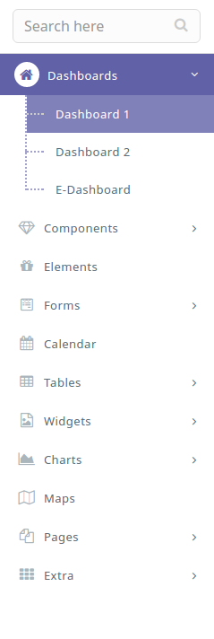

# Left Side Menu

It has the following design:



The Side Bar has the following structure :

```text
<div class="wrapper">
   <aside class="left-aside">
      <section class="sidebar">
           ...
      </section>  
   </div>
</div>
```

