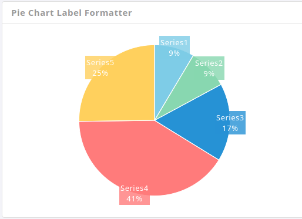

# Charts

To create the charts we use the following plugins [jquery-konob](http://anthonyterrien.com/knob/), [chartist](http://gionkunz.github.io/chartist-js/), [amcharts](https://www.amcharts.com/demos/) and [Flotchart](http://www.flotcharts.org/). Detailed information about its configuration you can find on their sites.

**1\)** **Flotchart:**

We can find more variants of these plugin on [Flotcharts](http://admire.lorvent.in/charts.html) page of this template.


It has the following design:

```text
<div id="basicFlotLegend" class="flotLegend"></div>
<div id="line-chart" class="flotChart1"></div>
```

**2\) Knob Charts:**


It has the following structure:

```text
<input class="knob" data-width="120" data-height="120" data-fgColor="#7EC4E7" value="35">
```

**3\) Pie Charts:**



It has the following structure:

```text
<div id="pie_chart3" class="h_300  w_100"></div>
```

**4\) Amcharts:**


It has the following Structure:

```text
<div id="chartdiv"></div>
```

