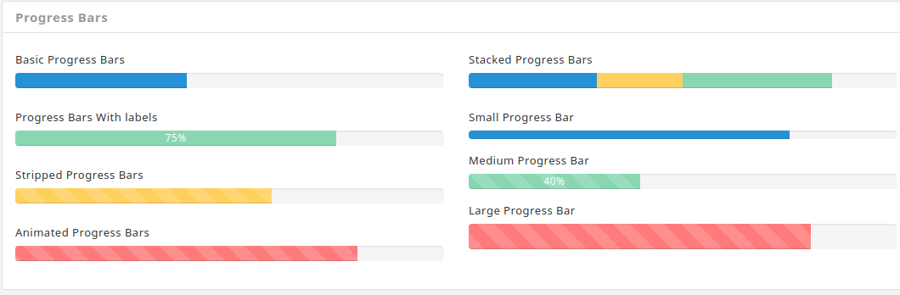
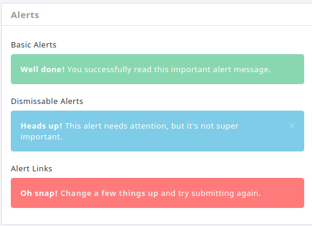
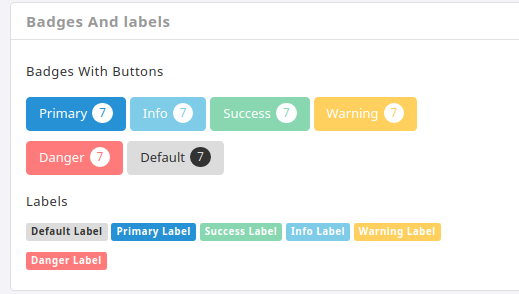

# Elements

There are different elements in this template.

**1\) Progress Bars :**

We can find different progress bars like stripped progress bars, animated and stacked progress bars.



It has the following structure:

```text
<div class="progress">
    <div class="progress-bar progress-bar-danger progress-bar-striped active" role="progressbar" 
      aria-valuenow="80" aria-valuemin="0" aria-valuemax="100" style="width: 80%">
       <span class="sr-only">80% Complete (danger)</span>
    </div>
</div>
```

2**\) Alerts :**

We can find alerts with disable and alerts with links.



It has the following structure:

```text
<div class="alert alert-danger" role="alert">
      <strong>Oh snap!</strong>
      <a href="#" class="alert-link">Change a few things up</a> 
      and try submitting again.
</div>
```

3**\) Buttons :**

Buttons with badges, block level buttons, vertical buttons and drop down buttons are used.



It has the following structure:

```text
<button type="button" class="btn btn-primary m-t-10">
   Primary <span class="badge">7</span>
</button>
<button type="button" class="btn btn-info m-t-10">
   Info <span class="badge">7</span>
</button>
```

