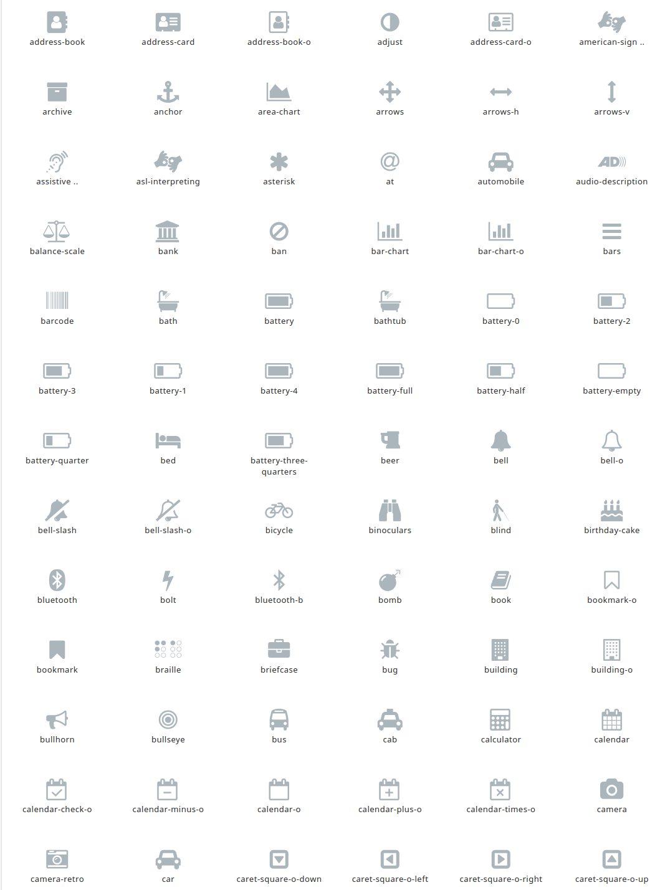

# Icons

There are different Fontawesome icons used in this theme

**Font Awesome Icons :**



It has the following Structure:

```text
<i class="fa fa-phone"></i>
```

**Icons Size** - determines the size of icons, can take such values: fa-lg, fa-2x, fa-3x, fa-4x and fa-5x

```text
<i class="fa fa-phone fa-lg"></i>
```

**Stacked icons** - It stacks the multiple icons. We can also control the size of the icons using the parameters : fa-stack-1x fa-stack-2x.

```text
<span class="fa-stack fa-lg">
 <i class="fa fa-circle fa-stack-2x text-info"></i>
   <i class="fa fa-home fa-stack-2x fa-inverse"></i>
</span>
```

