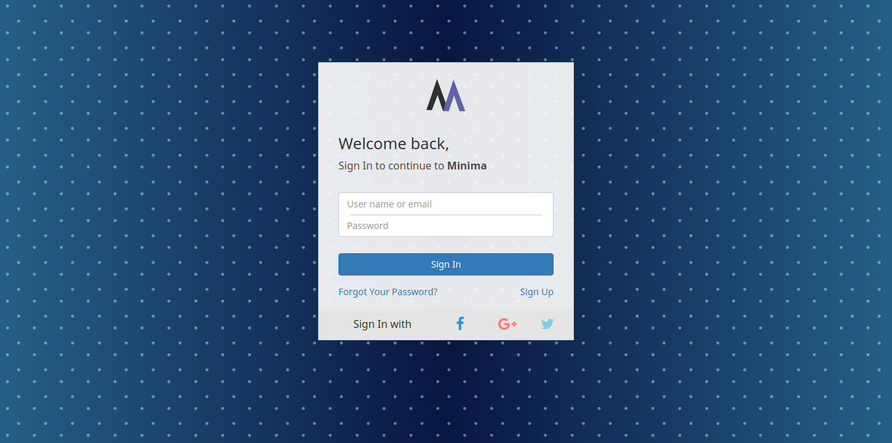

# Login

This is the unique feature in this template which generally is designed for the Authentication purpose.



It has the following Structure:

```text
<div class="row">
        <div class="col-md-4 col-md-offset-4 col-sm-6 col-sm-offset-3 col-xs-10 col-xs-offset-1 form-container">
     ...
     ...
    </div>
</div>
```

