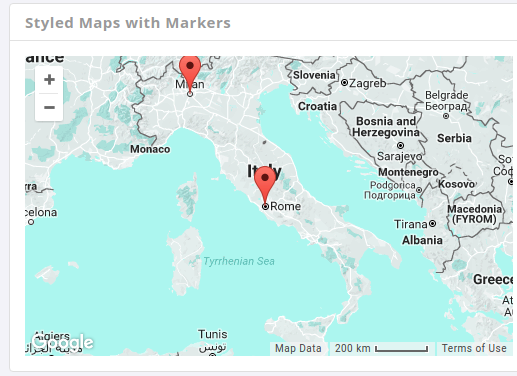
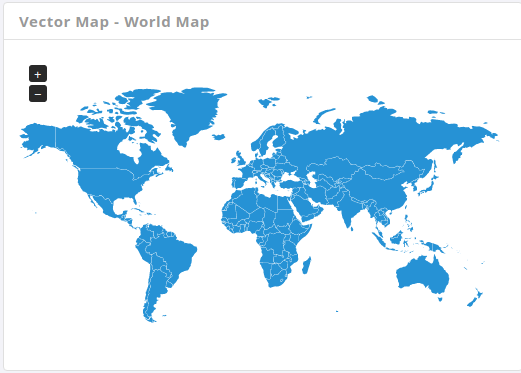

# Maps

There are two divergent maps used included in this template.

**1\) Google Maps :**

We can find different styles of this kind in the page [Google Maps](http://admire.lorvent.in/maps.html).



It has the following structure:

```text
 <div id="gmap-styled" class="gmap"></div>
```

_**parameters:**_

i**\) zoom** - This attribute sets the scale of the map \(by default - '8'\).This option is available is in the js file.

```text
zoom : 5
```

ii**\)** **center \[lat , lng\]** - these attributes set the coordinates of the center of the map and the point of the map \(by default - '41.895465 and '12.482324'\). This option is available in Js file.

```text
center : [41.895465, 12.482324]
```

iii**\) hue** - sets the hue of the feature to match the hue of the color supplied. Note that the saturation and lightness of the feature is conserved, which means that the feature will not match the color supplied exactly. Valid values: An RGB hex string, i.e. '\#ff0000'. This opion is available in the js file.

```text
hue : '#0075c2'
```

iv**\) Address** - This feature allows us to mention the current location. This option is available in the js file.

```text
address : "nallakunta,hyderabad"
```

v**\) Marker** - This feature allows the user to explicitly indicate the location. This option is available in the js file.

```text
icon : "images/location-mark.png"
```

**2\) Vector Maps :**

We can find different styles of this kind in the page [Vector Maps](http://admire.lorvent.in/jqvmaps.html).



It has the following structure:

```text
<div id="world-map"></div>
```

