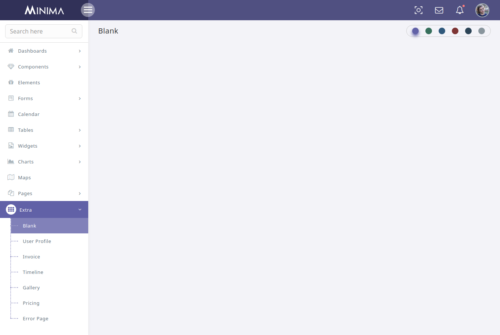

# Start New Page

The design for Blank Page is shown below:



It has the following Structure:

```text
<body>
<header class="header">
    ............
</header>
<aside class="left-aside">
    ...........
</aside>
<aside class="right-aside view-port-height">
    <section class="content-header">
        .......
    </section>
    <section class="content">
        .......
    </section>
</aside>
</body>
```

[    
](https://lorvent.gitbooks.io/clear/content/menu-bar-fold.html)

